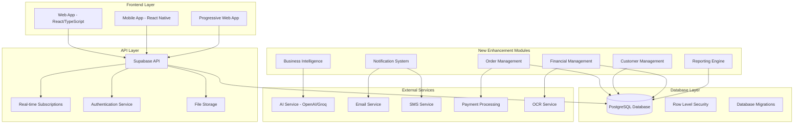
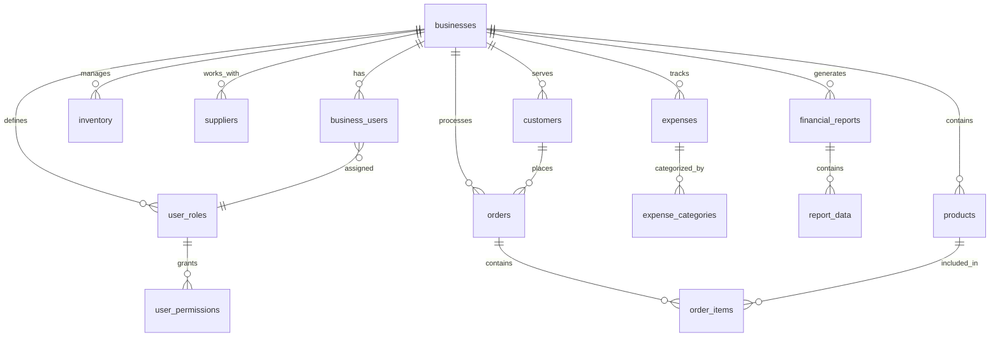

# BizPilot Enhancement Plan - Design Document

## Overview

This design document outlines the architecture and implementation approach for enhancing BizPilot with critical business management features. The enhancements build upon the existing solid foundation while maintaining architectural consistency and user experience quality.

**Current Architecture Strengths:**
- Modern React/TypeScript frontend with Vite build system
- Supabase backend with PostgreSQL and real-time capabilities
- Well-designed database schema with proper RLS policies
- Comprehensive authentication and session management
- Mobile app with complete feature parity
- AI integration for business insights

**Enhancement Goals:**
- Complete the business management ecosystem
- Maintain architectural consistency
- Preserve existing functionality
- Enhance user experience
- Ensure scalability and performance

## Architecture

### System Architecture Overview



### Database Architecture Enhancement

The existing database schema will be extended with new tables while maintaining the current structure:



## Components and Interfaces

### 1. Sales & Order Management System

#### Component Architecture
```typescript
// Core Order Management Components
interface OrderManagementSystem {
  // Main Components
  OrderList: React.FC<OrderListProps>
  OrderForm: React.FC<OrderFormProps>
  OrderDetail: React.FC<OrderDetailProps>
  OrderStatusTracker: React.FC<OrderStatusProps>
  
  // Supporting Components
  CustomerSelector: React.FC<CustomerSelectorProps>
  ProductSelector: React.FC<ProductSelectorProps>
  InventoryValidator: React.FC<InventoryValidatorProps>
  PaymentProcessor: React.FC<PaymentProcessorProps>
}

// Order State Management
interface OrderState {
  orders: Order[]
  currentOrder: Order | null
  orderStatuses: OrderStatus[]
  loading: boolean
  error: string | null
}

// Order Business Logic
interface OrderService {
  createOrder(orderData: CreateOrderRequest): Promise<Order>
  updateOrderStatus(orderId: string, status: OrderStatus): Promise<void>
  calculateOrderTotal(items: OrderItem[]): Promise<OrderTotal>
  validateInventory(items: OrderItem[]): Promise<InventoryValidation>
  processPayment(orderId: string, paymentData: PaymentData): Promise<PaymentResult>
}
```

#### Database Schema Extensions
```sql
-- Orders table
CREATE TABLE orders (
  id uuid PRIMARY KEY DEFAULT gen_random_uuid(),
  business_id uuid REFERENCES businesses(id) NOT NULL,
  customer_id uuid REFERENCES customers(id),
  order_number text UNIQUE NOT NULL,
  status order_status DEFAULT 'pending',
  subtotal decimal(10,2) NOT NULL,
  tax_amount decimal(10,2) DEFAULT 0,
  discount_amount decimal(10,2) DEFAULT 0,
  total_amount decimal(10,2) NOT NULL,
  payment_status payment_status DEFAULT 'pending',
  payment_method text,
  notes text,
  shipping_address jsonb,
  billing_address jsonb,
  estimated_delivery_date date,
  actual_delivery_date date,
  created_at timestamptz DEFAULT now(),
  updated_at timestamptz DEFAULT now()
);

-- Order items table
CREATE TABLE order_items (
  id uuid PRIMARY KEY DEFAULT gen_random_uuid(),
  order_id uuid REFERENCES orders(id) ON DELETE CASCADE,
  product_id uuid REFERENCES products(id),
  quantity integer NOT NULL CHECK (quantity > 0),
  unit_price decimal(10,2) NOT NULL,
  total_price decimal(10,2) NOT NULL,
  notes text
);

-- Order status history
CREATE TABLE order_status_history (
  id uuid PRIMARY KEY DEFAULT gen_random_uuid(),
  order_id uuid REFERENCES orders(id) ON DELETE CASCADE,
  status order_status NOT NULL,
  changed_by uuid REFERENCES auth.users(id),
  changed_at timestamptz DEFAULT now(),
  notes text
);

-- Custom types
CREATE TYPE order_status AS ENUM (
  'pending', 'confirmed', 'processing', 'shipped', 'delivered', 'cancelled', 'refunded'
);

CREATE TYPE payment_status AS ENUM (
  'pending', 'paid', 'partially_paid', 'refunded', 'failed'
);
```

### 2. Customer Relationship Management

#### Component Architecture
```typescript
// Customer Management Components
interface CustomerManagementSystem {
  CustomerList: React.FC<CustomerListProps>
  CustomerForm: React.FC<CustomerFormProps>
  CustomerDetail: React.FC<CustomerDetailProps>
  CustomerAnalytics: React.FC<CustomerAnalyticsProps>
  CustomerCommunication: React.FC<CustomerCommunicationProps>
}

// Customer Data Models
interface Customer {
  id: string
  business_id: string
  name: string
  email?: string
  phone?: string
  address?: Address
  company?: string
  notes?: string
  tags: string[]
  total_orders: number
  total_spent: number
  average_order_value: number
  last_order_date?: Date
  customer_since: Date
  preferred_contact_method: 'email' | 'phone' | 'sms'
  created_at: Date
  updated_at: Date
}

interface CustomerAnalytics {
  lifetime_value: number
  purchase_frequency: number
  average_order_value: number
  preferred_products: Product[]
  seasonal_patterns: SeasonalData[]
  communication_preferences: CommunicationPrefs
}
```

#### Database Schema
```sql
-- Customers table
CREATE TABLE customers (
  id uuid PRIMARY KEY DEFAULT gen_random_uuid(),
  business_id uuid REFERENCES businesses(id) NOT NULL,
  name text NOT NULL,
  email text,
  phone text,
  company text,
  address jsonb,
  notes text,
  tags text[] DEFAULT '{}',
  total_orders integer DEFAULT 0,
  total_spent decimal(10,2) DEFAULT 0,
  average_order_value decimal(10,2) DEFAULT 0,
  last_order_date date,
  preferred_contact_method text DEFAULT 'email',
  created_at timestamptz DEFAULT now(),
  updated_at timestamptz DEFAULT now(),
  
  CONSTRAINT valid_contact_method CHECK (
    preferred_contact_method IN ('email', 'phone', 'sms')
  )
);

-- Customer communication history
CREATE TABLE customer_communications (
  id uuid PRIMARY KEY DEFAULT gen_random_uuid(),
  customer_id uuid REFERENCES customers(id) ON DELETE CASCADE,
  type communication_type NOT NULL,
  subject text,
  content text,
  sent_at timestamptz DEFAULT now(),
  sent_by uuid REFERENCES auth.users(id),
  status communication_status DEFAULT 'sent'
);

CREATE TYPE communication_type AS ENUM ('email', 'sms', 'phone', 'note');
CREATE TYPE communication_status AS ENUM ('sent', 'delivered', 'read', 'failed');
```

### 3. Advanced Financial Management

#### Component Architecture
```typescript
// Financial Management System
interface FinancialManagementSystem {
  ExpenseTracker: React.FC<ExpenseTrackerProps>
  ReceiptCapture: React.FC<ReceiptCaptureProps>
  FinancialReports: React.FC<FinancialReportsProps>
  ProfitAnalysis: React.FC<ProfitAnalysisProps>
  TaxReporting: React.FC<TaxReportingProps>
  CashFlowAnalysis: React.FC<CashFlowAnalysisProps>
}

// Financial Data Models
interface Expense {
  id: string
  business_id: string
  category_id: string
  amount: number
  description: string
  receipt_url?: string
  receipt_data?: ReceiptOCRData
  expense_date: Date
  payment_method: string
  vendor?: string
  tax_deductible: boolean
  tags: string[]
  created_by: string
  created_at: Date
}

interface FinancialReport {
  id: string
  business_id: string
  report_type: 'profit_loss' | 'cash_flow' | 'balance_sheet' | 'tax_summary'
  period_start: Date
  period_end: Date
  data: ReportData
  generated_at: Date
  generated_by: string
}
```

#### Database Schema
```sql
-- Expense categories
CREATE TABLE expense_categories (
  id uuid PRIMARY KEY DEFAULT gen_random_uuid(),
  business_id uuid REFERENCES businesses(id) NOT NULL,
  name text NOT NULL,
  description text,
  tax_deductible boolean DEFAULT true,
  parent_id uuid REFERENCES expense_categories(id),
  created_at timestamptz DEFAULT now()
);

-- Expenses table
CREATE TABLE expenses (
  id uuid PRIMARY KEY DEFAULT gen_random_uuid(),
  business_id uuid REFERENCES businesses(id) NOT NULL,
  category_id uuid REFERENCES expense_categories(id),
  amount decimal(10,2) NOT NULL CHECK (amount > 0),
  description text NOT NULL,
  receipt_url text,
  receipt_data jsonb,
  expense_date date NOT NULL,
  payment_method text,
  vendor text,
  tax_deductible boolean DEFAULT true,
  tags text[] DEFAULT '{}',
  created_by uuid REFERENCES auth.users(id),
  created_at timestamptz DEFAULT now(),
  updated_at timestamptz DEFAULT now()
);

-- Financial reports
CREATE TABLE financial_reports (
  id uuid PRIMARY KEY DEFAULT gen_random_uuid(),
  business_id uuid REFERENCES businesses(id) NOT NULL,
  report_type report_type NOT NULL,
  period_start date NOT NULL,
  period_end date NOT NULL,
  data jsonb NOT NULL,
  generated_at timestamptz DEFAULT now(),
  generated_by uuid REFERENCES auth.users(id)
);

CREATE TYPE report_type AS ENUM (
  'profit_loss', 'cash_flow', 'balance_sheet', 'tax_summary', 'expense_analysis'
);
```

### 4. Team Collaboration & Multi-User Support

#### Enhanced Role-Based Access Control
```typescript
// Enhanced User Management
interface EnhancedUserManagement {
  UserInvitation: React.FC<UserInvitationProps>
  RoleManagement: React.FC<RoleManagementProps>
  PermissionMatrix: React.FC<PermissionMatrixProps>
  ActivityAudit: React.FC<ActivityAuditProps>
  TeamDashboard: React.FC<TeamDashboardProps>
}

// Permission System
interface Permission {
  resource: string // 'orders', 'customers', 'products', etc.
  action: 'create' | 'read' | 'update' | 'delete' | 'manage'
  conditions?: PermissionCondition[]
}

interface Role {
  id: string
  business_id: string
  name: string
  description: string
  permissions: Permission[]
  is_default: boolean
  created_at: Date
}
```

#### Database Schema Extensions
```sql
-- Enhanced user roles with granular permissions
CREATE TABLE user_role_permissions (
  id uuid PRIMARY KEY DEFAULT gen_random_uuid(),
  role_id uuid REFERENCES user_roles(id) ON DELETE CASCADE,
  resource text NOT NULL,
  action text NOT NULL,
  conditions jsonb DEFAULT '{}',
  created_at timestamptz DEFAULT now(),
  
  UNIQUE(role_id, resource, action)
);

-- Activity audit log
CREATE TABLE activity_log (
  id uuid PRIMARY KEY DEFAULT gen_random_uuid(),
  business_id uuid REFERENCES businesses(id) NOT NULL,
  user_id uuid REFERENCES auth.users(id),
  action text NOT NULL,
  resource_type text NOT NULL,
  resource_id text,
  old_values jsonb,
  new_values jsonb,
  ip_address inet,
  user_agent text,
  created_at timestamptz DEFAULT now()
);

-- User invitations
CREATE TABLE user_invitations (
  id uuid PRIMARY KEY DEFAULT gen_random_uuid(),
  business_id uuid REFERENCES businesses(id) NOT NULL,
  email text NOT NULL,
  role_id uuid REFERENCES user_roles(id),
  invited_by uuid REFERENCES auth.users(id),
  invitation_token text UNIQUE NOT NULL,
  expires_at timestamptz NOT NULL,
  accepted_at timestamptz,
  created_at timestamptz DEFAULT now(),
  
  UNIQUE(business_id, email)
);
```

## Data Models

### Core Data Model Extensions

```typescript
// Enhanced Product Model
interface EnhancedProduct extends Product {
  sales_data: {
    total_sold: number
    revenue_generated: number
    average_selling_price: number
    last_sold_date?: Date
  }
  performance_metrics: {
    profit_margin_trend: number[]
    demand_forecast: number[]
    reorder_recommendations: ReorderRecommendation[]
  }
}

// Order Management Models
interface Order {
  id: string
  business_id: string
  customer_id?: string
  order_number: string
  status: OrderStatus
  items: OrderItem[]
  subtotal: number
  tax_amount: number
  discount_amount: number
  total_amount: number
  payment_status: PaymentStatus
  payment_method?: string
  shipping_address?: Address
  billing_address?: Address
  notes?: string
  estimated_delivery_date?: Date
  actual_delivery_date?: Date
  created_at: Date
  updated_at: Date
}

interface OrderItem {
  id: string
  order_id: string
  product_id: string
  product: Product
  quantity: number
  unit_price: number
  total_price: number
  notes?: string
}

// Financial Models
interface ExpenseWithCategory extends Expense {
  category: ExpenseCategory
  receipt_analysis?: ReceiptOCRData
}

interface FinancialSummary {
  period: DateRange
  revenue: {
    total: number
    by_month: MonthlyData[]
    by_product: ProductRevenue[]
    by_customer: CustomerRevenue[]
  }
  expenses: {
    total: number
    by_category: CategoryExpense[]
    by_month: MonthlyData[]
  }
  profit: {
    gross: number
    net: number
    margin_percentage: number
    trend: number[]
  }
}
```

## Error Handling

### Comprehensive Error Management Strategy

```typescript
// Error Types and Handling
interface BusinessError {
  code: string
  message: string
  details?: any
  timestamp: Date
  user_id?: string
  business_id?: string
}

// Error Categories
enum ErrorCategory {
  VALIDATION = 'validation',
  BUSINESS_LOGIC = 'business_logic',
  INTEGRATION = 'integration',
  SYSTEM = 'system',
  PERMISSION = 'permission'
}

// Error Handling Service
class ErrorHandlingService {
  static handleOrderError(error: OrderError): UserFriendlyError
  static handlePaymentError(error: PaymentError): UserFriendlyError
  static handleInventoryError(error: InventoryError): UserFriendlyError
  static handleCustomerError(error: CustomerError): UserFriendlyError
  static logError(error: BusinessError): Promise<void>
  static notifyAdmins(criticalError: CriticalError): Promise<void>
}

// Specific Error Handlers
interface OrderErrorHandling {
  insufficientInventory: (items: OrderItem[]) => InventoryError
  invalidCustomer: (customerId: string) => CustomerError
  paymentFailed: (paymentData: PaymentData) => PaymentError
  orderNotFound: (orderId: string) => NotFoundError
}
```

### Error Recovery Mechanisms

```typescript
// Automatic Error Recovery
interface ErrorRecovery {
  retryableOperations: {
    paymentProcessing: RetryConfig
    inventoryUpdates: RetryConfig
    emailNotifications: RetryConfig
    reportGeneration: RetryConfig
  }
  
  fallbackStrategies: {
    offlineMode: OfflineModeConfig
    degradedService: DegradedServiceConfig
    emergencyMode: EmergencyModeConfig
  }
}

// Circuit Breaker Pattern for External Services
class CircuitBreaker {
  private failureCount = 0
  private lastFailureTime?: Date
  private state: 'CLOSED' | 'OPEN' | 'HALF_OPEN' = 'CLOSED'
  
  async execute<T>(operation: () => Promise<T>): Promise<T>
  private shouldAttemptReset(): boolean
  private onSuccess(): void
  private onFailure(): void
}
```

## Testing Strategy

### Comprehensive Testing Approach

```typescript
// Testing Pyramid Structure
interface TestingStrategy {
  unit_tests: {
    business_logic: BusinessLogicTests
    data_models: DataModelTests
    utilities: UtilityTests
    components: ComponentTests
  }
  
  integration_tests: {
    api_endpoints: APIIntegrationTests
    database_operations: DatabaseTests
    external_services: ExternalServiceTests
    user_workflows: WorkflowTests
  }
  
  end_to_end_tests: {
    critical_user_journeys: E2ETests
    cross_browser_testing: BrowserTests
    mobile_app_testing: MobileE2ETests
    performance_testing: PerformanceTests
  }
}

// Test Data Management
interface TestDataStrategy {
  fixtures: {
    sample_businesses: Business[]
    sample_customers: Customer[]
    sample_orders: Order[]
    sample_products: Product[]
  }
  
  factories: {
    BusinessFactory: () => Business
    CustomerFactory: () => Customer
    OrderFactory: () => Order
    ProductFactory: () => Product
  }
  
  cleanup: {
    beforeEach: () => Promise<void>
    afterEach: () => Promise<void>
    afterAll: () => Promise<void>
  }
}
```

### Performance Testing Strategy

```typescript
// Performance Benchmarks
interface PerformanceTargets {
  page_load_times: {
    dashboard: '< 2s'
    order_list: '< 1.5s'
    customer_list: '< 1.5s'
    reports: '< 3s'
  }
  
  api_response_times: {
    create_order: '< 500ms'
    update_inventory: '< 300ms'
    generate_report: '< 2s'
    search_customers: '< 200ms'
  }
  
  concurrent_users: {
    target: 100
    maximum: 500
    degradation_threshold: '10%'
  }
}

// Load Testing Scenarios
interface LoadTestingScenarios {
  normal_usage: UserScenario[]
  peak_usage: UserScenario[]
  stress_testing: StressScenario[]
  spike_testing: SpikeScenario[]
}
```

## Security Considerations

### Enhanced Security Measures

```typescript
// Security Framework
interface SecurityEnhancements {
  authentication: {
    multi_factor_auth: MFAConfig
    session_management: SessionConfig
    password_policies: PasswordPolicy
    oauth_providers: OAuthConfig[]
  }
  
  authorization: {
    role_based_access: RBACConfig
    resource_permissions: PermissionConfig
    api_rate_limiting: RateLimitConfig
    audit_logging: AuditConfig
  }
  
  data_protection: {
    encryption_at_rest: EncryptionConfig
    encryption_in_transit: TLSConfig
    pii_handling: PIIProtectionConfig
    data_retention: RetentionPolicy
  }
}

// API Security
interface APISecurityMeasures {
  input_validation: ValidationRules
  sql_injection_prevention: SQLInjectionProtection
  xss_protection: XSSProtection
  csrf_protection: CSRFProtection
  cors_configuration: CORSConfig
}
```

### Compliance and Privacy

```typescript
// Compliance Framework
interface ComplianceRequirements {
  gdpr: {
    data_subject_rights: DataSubjectRights
    consent_management: ConsentManagement
    data_portability: DataPortability
    right_to_erasure: RightToErasure
  }
  
  financial_compliance: {
    tax_reporting: TaxReporting
    audit_trails: AuditTrails
    financial_controls: FinancialControls
    regulatory_reporting: RegulatoryReporting
  }
}
```

This design document provides a comprehensive blueprint for enhancing BizPilot while maintaining its architectural integrity and user experience quality. The modular approach ensures that each enhancement can be implemented incrementally without disrupting existing functionality.