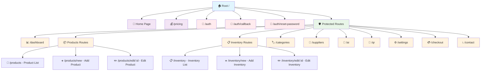
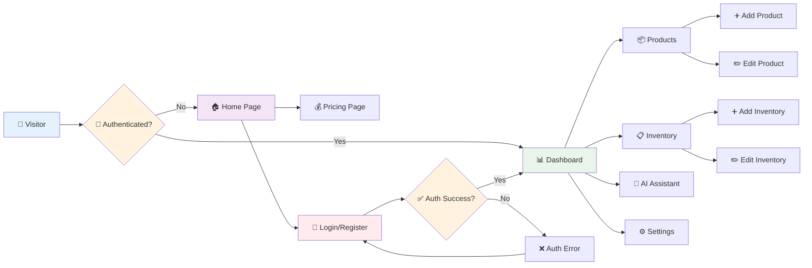

# 🚀 BizPilot - Business Management Platform

A comprehensive business management application designed to help entrepreneurs and small businesses streamline their operations, manage inventory, track products, and make data-driven decisions.

## ✨ Features

### 📊 **Dashboard & Analytics**
- Real-time business metrics and KPIs
- Interactive charts for profit trends, cost breakdowns, and inventory status
- Comprehensive business insights and performance tracking

### 📦 **Inventory Management**
- Complete inventory tracking with stock levels
- Low stock alerts and reorder points
- Batch/lot number tracking with expiration dates
- Cost per unit tracking and valuation

### 🏷️ **Product Management**
- Product catalog with SKU, barcode, and location tracking
- Ingredient-based cost calculations
- Profit margin analysis and pricing optimization
- Category and supplier management

### 🏪 **Supplier Management**
- Supplier database with contact information
- Purchase tracking and supplier performance metrics
- Integration with product and inventory systems

### 📱 **QR Code Generation**
- Generate QR codes for products and inventory items
- Quick access to product information via QR scanning

### 🤖 **AI Assistant**
- Intelligent business insights and recommendations
- Chat-based interface for business queries
- Context-aware responses based on your business data

### 🔐 **Authentication & Security**
- Secure user authentication with Supabase Auth
- Email/password and OAuth login options
- Protected routes and user session management

### ⚙️ **Settings & Customization**
- User preferences and business settings
- Customizable hourly rates and business parameters
- Dark theme optimized interface

## 🛠️ Tech Stack

- **Frontend**: React 18 + TypeScript
- **Build Tool**: Vite
- **Styling**: Tailwind CSS
- **UI Components**: Custom components with Radix UI primitives
- **Animations**: Framer Motion
- **Charts**: Chart.js with React Chart.js 2
- **3D Graphics**: Three.js with React Three Fiber
- **Backend**: Supabase (PostgreSQL + Auth + Real-time)
- **Icons**: Lucide React + React Icons
- **QR Codes**: qrcode library
- **Error Tracking**: Sentry
- **State Management**: React Hooks + Custom Hooks

## 📁 Project Structure

```
BizPilot/
├── 📄 README.md
├── 📄 package.json
├── 📄 package-lock.json
├── 📄 index.html
├── 📄 vite.config.js
├── 📄 tailwind.config.js
├── 📄 postcss.config.js
├── 📄 tsconfig.json
├── 📄 tsconfig.node.json
├── 📄 .gitignore
├── 📄 prd.md
├── 📁 docs/
│   └── 📄 localflow_prd_v2.md
├── 📁 src/
│   ├── 📄 main.tsx              # Application entry point
│   ├── 📄 App.tsx               # Main app component
│   ├── 📄 index.css             # Global styles
│   ├── 📄 vite-env.d.ts         # Vite type definitions
│   ├── 📁 components/
│   │   ├── 📁 ai/
│   │   │   └── 📄 AIChat.tsx           # AI assistant chat interface
│   │   ├── 📁 auth/
│   │   │   ├── 📄 AuthCallback.tsx     # OAuth callback handler
│   │   │   ├── 📄 AuthForm.tsx         # Main authentication form
│   │   │   ├── 📄 AuthProvider.tsx     # Authentication context provider
│   │   │   ├── 📄 AuthTabs.tsx         # Login/signup tabs
│   │   │   ├── 📄 EmailAuthForm.tsx    # Email authentication form
│   │   │   ├── 📄 OAuthButtons.tsx     # Social login buttons
│   │   │   ├── 📄 ProtectedRoute.tsx   # Route protection wrapper
│   │   │   └── 📄 ResetPasswordForm.tsx # Password reset form
│   │   ├── 📁 categories/
│   │   │   └── 📄 CategoryManagement.tsx # Product categories management
│   │   ├── 📁 charts/
│   │   │   ├── 📄 ChartRegistry.ts      # Chart.js configuration
│   │   │   ├── 📄 CostBreakdownChart.tsx
│   │   │   ├── 📄 InventoryStatusChart.tsx
│   │   │   ├── 📄 ProfitMarginChart.tsx
│   │   │   └── 📄 ProfitTrendChart.tsx
│   │   ├── 📁 checkout/
│   │   │   └── 📄 CheckoutPage.tsx      # E-commerce checkout flow
│   │   ├── 📁 common/
│   │   │   └── 📄 Logo.tsx             # Application logo component
│   │   ├── 📁 contact/
│   │   │   └── 📄 ContactForm.tsx      # Contact form component
│   │   ├── 📁 dashboard/
│   │   │   ├── 📄 Dashboard.tsx        # Main dashboard view
│   │   │   └── 📄 DashboardCharts.tsx  # Dashboard analytics charts
│   │   ├── 📁 home/
│   │   │   └── 📄 HomePage.tsx         # Landing page component
│   │   ├── 📁 inventory/
│   │   │   ├── 📄 InventoryForm.tsx    # Add/edit inventory items
│   │   │   └── 📄 InventoryList.tsx    # Inventory list with search
│   │   ├── 📁 layout/
│   │   │   ├── 📄 Layout.tsx           # Main app layout wrapper
│   │   │   └── 📄 Navigation.tsx       # Navigation menu
│   │   ├── 📁 pricing/
│   │   │   └── 📄 PricingPage.tsx      # Pricing tiers page
│   │   ├── 📁 products/
│   │   │   ├── 📄 ProductForm.tsx      # Add/edit products
│   │   │   └── 📄 ProductList.tsx      # Product catalog view
│   │   ├── 📁 qr/
│   │   │   └── 📄 QRGenerator.tsx      # QR code generation
│   │   ├── 📁 settings/
│   │   │   └── 📄 UserSettings.tsx     # User preferences
│   │   ├── 📁 suppliers/
│   │   │   └── 📄 SupplierManagement.tsx # Supplier database
│   │   └── 📁 ui/
│   │       ├── 📄 button.tsx           # Reusable button component
│   │       ├── 📄 card.tsx             # Card UI component
│   │       ├── 📄 futuristic-hero-section.tsx
│   │       └── 📄 pricing-card.tsx     # Pricing tier cards
│   ├── 📁 hooks/
│   │   ├── 📄 useAIChat.ts             # AI chat functionality
│   │   ├── 📄 useAuth.ts               # Authentication hooks
│   │   ├── 📄 useCategories.ts         # Product categories logic
│   │   ├── 📄 useInventory.ts          # Inventory management hooks
│   │   ├── 📄 useQRCodes.ts            # QR code generation hooks
│   │   ├── 📄 useSuppliers.ts          # Supplier management hooks
│   │   └── 📄 useUserSettings.ts       # User settings hooks
│   ├── 📁 lib/
│   │   ├── 📄 supabase.ts              # Supabase client configuration
│   │   └── 📄 utils.ts                 # General utility functions
│   └── 📁 utils/
│       └── 📄 calculations.ts          # Business calculation utilities
├── 📁 supabase/
│   └── 📁 migrations/                  # Database migration files
│       ├── 📄 20250629225210_rough_spark.sql
│       ├── 📄 20250630030705_tiny_river.sql
│       ├── 📄 20250630042823_bright_shrine.sql
│       ├── 📄 20250630043807_rough_manor.sql
│       ├── 📄 20250630051041_bold_valley.sql
│       ├── 📄 20250630051201_sunny_math.sql
│       ├── 📄 20250630051243_wooden_firefly.sql
│       ├── 📄 20250630052226_nameless_wave.sql
│       ├── 📄 20250630053004_lively_surf.sql
│       ├── 📄 20250630122210_winter_base.sql
│       └── 📄 20250630123128_crystal_snowflake.sql
└── 📁 dist/                           # Production build output
    ├── 📄 index.html
    └── 📁 assets/
        ├── 📄 index-[hash].js
        └── 📄 index-[hash].css
```

## 🗺️ Route Structure

The application uses React Router for navigation with both public and protected routes:



### Route Categories

#### 🌐 **Public Routes**
| Route | Component | Description |
|-------|-----------|-------------|
| `/` | HomePage | Landing page with hero section and features |
| `/pricing` | PricingPage | Subscription plans and pricing tiers |
| `/auth` | AuthForm | Login/register forms with social auth |
| `/auth/callback` | AuthCallback | OAuth callback handler |
| `/auth/reset-password` | ResetPasswordForm | Password reset interface |

#### 🛡️ **Protected Routes** (Require Authentication)
| Route | Component | Description |
|-------|-----------|-------------|
| `/dashboard` | Dashboard | Main analytics dashboard with charts |
| `/products` | ProductList | Product catalog with search and filters |
| `/products/new` | ProductForm | Create new product form |
| `/products/edit/:id` | ProductForm | Edit existing product |
| `/inventory` | InventoryList | Inventory management interface |
| `/inventory/new` | InventoryForm | Add new inventory item |
| `/inventory/edit/:id` | InventoryForm | Edit inventory item |
| `/categories` | CategoryManagement | Manage product categories |
| `/suppliers` | SupplierManagement | Supplier database management |
| `/ai` | AIChat | AI assistant chat interface |
| `/qr` | QRGenerator | QR code generation tools |
| `/settings` | UserSettings | User preferences and configuration |
| `/checkout` | CheckoutPage | Subscription checkout flow |
| `/contact` | ContactForm | Contact support form |

### Navigation Flow



### Route Protection

All routes under the protected section use the `ProtectedRoute` wrapper that:
- ✅ Checks user authentication status
- 🔄 Redirects to `/auth` if not authenticated  
- 🛡️ Wraps content in the main `Layout` component
- 📱 Provides consistent navigation and UI structure

## 🚀 Getting Started

### Prerequisites

- **Node.js** 18+ 
- **npm** or **yarn**
- **Supabase** account for backend services

### Installation

1. **Clone the repository**
   ```bash
   git clone https://github.com/ZoliswaDube/BizPilot.git
   cd BizPilot
   ```

2. **Install dependencies**
   ```bash
   npm install
   ```

3. **Environment Setup**
   Create a `.env` file in the root directory:
   ```env
   VITE_SUPABASE_URL=your_supabase_project_url
   VITE_SUPABASE_ANON_KEY=your_supabase_anon_key
   ```

4. **Database Setup**
   ```bash
   # Run Supabase migrations (if using Supabase CLI)
   supabase db push
   ```

### Development

```bash
# Start development server
npm run dev

# Open http://localhost:5173 in your browser
```

### Building for Production

```bash
# Build the application
npm run build

# Preview production build
npm run preview
```

### Code Quality

```bash
# Run TypeScript type checking
npm run build  # Includes tsc

# Run ESLint
npm run lint
```

## 🚀 Deployment

The application builds to static files and can be deployed to any static hosting service:

- **Vercel**: Connect your GitHub repository for automatic deployments
- **Netlify**: Drag and drop the `dist/` folder or connect via Git
- **GitHub Pages**: Deploy from the `dist/` branch
- **Traditional hosting**: Upload contents of `dist/` folder

### Build Output
- `dist/index.html` - Main application entry point
- `dist/assets/` - Optimized CSS and JavaScript bundles

## 🔧 Configuration

### Supabase Setup

1. Create a new Supabase project
2. Run the provided migrations in `supabase/migrations/`
3. Set up Row Level Security (RLS) policies
4. Configure authentication providers if using OAuth

### Environment Variables

| Variable | Description | Required |
|----------|-------------|----------|
| `VITE_SUPABASE_URL` | Your Supabase project URL | ✅ |
| `VITE_SUPABASE_ANON_KEY` | Your Supabase anonymous key | ✅ |

## 📊 Features Deep Dive

### **Inventory Management**
- Track current stock levels with real-time updates
- Set low stock alerts and reorder points
- Manage batch/lot numbers and expiration dates
- Calculate total inventory value

### **Product Catalog**
- SKU and barcode management
- Ingredient-based cost calculations
- Profit margin analysis
- Category and supplier relationships

### **Business Analytics**
- Profit trend visualization
- Cost breakdown analysis
- Inventory status monitoring
- Performance metrics dashboard

### **AI Assistant**
- Context-aware business insights
- Natural language query interface
- Personalized recommendations
- Data-driven decision support

## 🤝 Contributing

1. Fork the repository
2. Create a feature branch (`git checkout -b feature/amazing-feature`)
3. Commit your changes (`git commit -m 'Add amazing feature'`)
4. Push to the branch (`git push origin feature/amazing-feature`)
5. Open a Pull Request

### Development Guidelines

- Follow TypeScript best practices
- Use Tailwind CSS for styling
- Implement proper error handling
- Add proper type definitions
- Write meaningful commit messages

## 📄 License

This project is licensed under the MIT License - see the [LICENSE](LICENSE) file for details.

## 🙏 Acknowledgments

- Built with [React](https://reactjs.org/) and [TypeScript](https://www.typescriptlang.org/)
- UI powered by [Tailwind CSS](https://tailwindcss.com/)
- Backend services by [Supabase](https://supabase.com/)
- Icons from [Lucide](https://lucide.dev/)
- Charts by [Chart.js](https://www.chartjs.org/)

---

**BizPilot** - Empowering businesses with intelligent management tools 🚀
